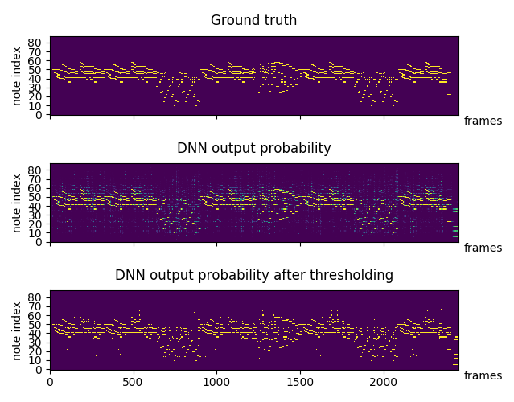

# Automatic music transcription (AMT) of polyphonic piano using deep neural network (Implemented using pytorch). 

## The "Learning the Attack, Decay and Pitch for Piano Music Transcription" code will be pushed soon. 

Author: Qiuqiang Kong (q.kong@surrey.ac.uk)

## Summary
A fully connected neural network is used for training followed [1] (implemented using pytorch). Log Mel frequency with 229 bins are used as input feature [2]. 

## Result
On the test set, frame wise F value around 75% can obtained after a few minutes training. 

## Dataset
Download dataset from http://www.tsi.telecom-paristech.fr/aao/en/2010/07/08/maps-database-a-piano-database-for-multipitch-estimation-and-automatic-transcription-of-music/

If you fail to download the dataset, you may download the already calculated log Mel feature & ground truth note from here https://drive.google.com/open?id=1OtK4tSrparkYVg_IrQvSDPJRtlwaQ_1k

## Install requirements
1. `pip install -r requirements.txt`
2. Install pytorch following http://pytorch.org/

## Run
1. Modify dataset path in `runme.sh`
2. Run `./runme.sh`

## Transcription result of Chopin Op. 66 Fantasie Impromptu
Real play: [real_play.wav](https://drive.google.com/open?id=1kwhsM2b_CmPfnRgJPqPmtCRn9bIm7qoD)

Transcripted result: [midi_result.wav](https://drive.google.com/open?id=1HwnVdPZjRxqNE-hum1FLxyZTfjaK8P29)

Visualization of piano roll. 

## Reference
[1] Sigtia, S., Benetos, E. and Dixon, S., 2016. An end-to-end neural network for polyphonic piano music transcription. IEEE/ACM Transactions on Audio, Speech and Language Processing (TASLP), 24(5), pp.927-939. 

[2] Hawthorne, C., Elsen, E., Song, J., Roberts, A., Simon, I., Raffel, C., Engel, J., Oore, S. and Eck, D., 2017. Onsets and Frames: Dual-Objective Piano Transcription. arXiv preprint arXiv:1710.11153. 
